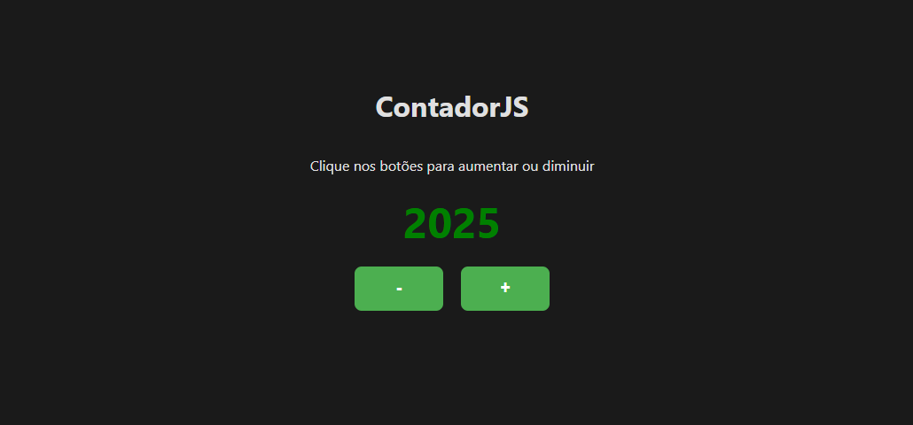

# ContadorJS
### ↪ Um simples contador, pode te ajudar a contar quantos grãos de arroz existe em uma tigela
### <a href="https://roycyeduardo.github.io/ContadorJS" target="_blank">Visualizar Website</a>

